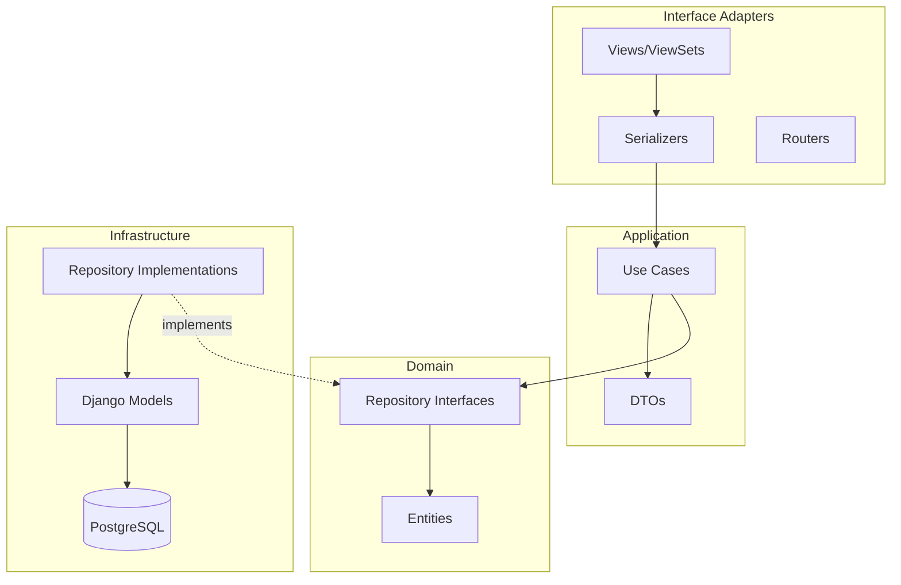
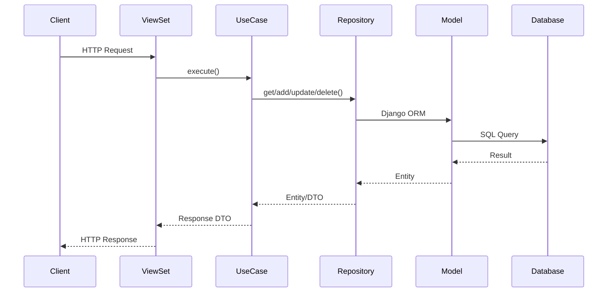

# Diagrama de Arquitetura Clean Architecture

## Visão Geral da Arquitetura

## Fluxo de Dados

## Camadas da Arquitetura

### 1. Domain (Entidades e Contratos)
- **Entities**: Cliente, Venda (puro Python)
- **Repository Interfaces**: Contratos abstratos

### 2. Application (Casos de Uso)
- **Use Cases**: Lógica de negócio
- **DTOs**: Objetos de transferência de dados

### 3. Infrastructure (Implementações)
- **Models**: Django ORM
- **Repository Implementations**: Implementações concretas

### 4. Interface Adapters (Apresentação)
- **Views**: ViewSets do DRF
- **Serializers**: Serialização JSON
- **Routers**: Configuração de URLs

## Benefícios da Arquitetura

- ✅ **Independência de frameworks**
- ✅ **Testabilidade**
- ✅ **Manutenibilidade**
- ✅ **Escalabilidade**
- ✅ **Separação de responsabilidades** 