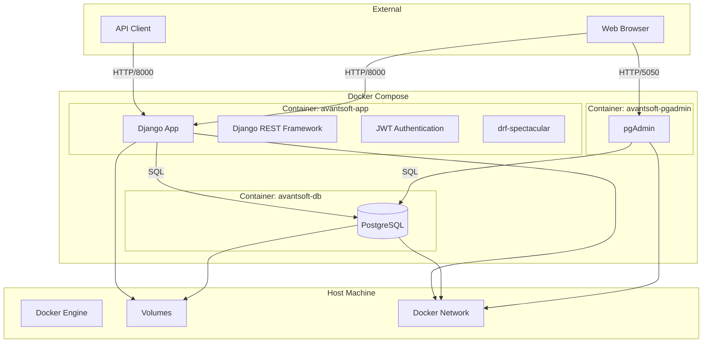
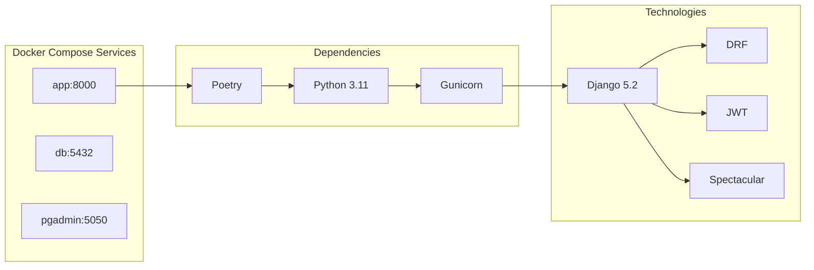
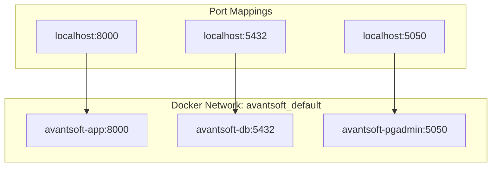
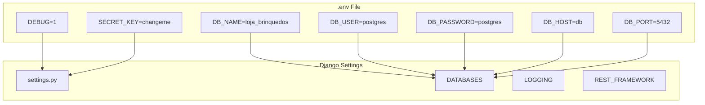
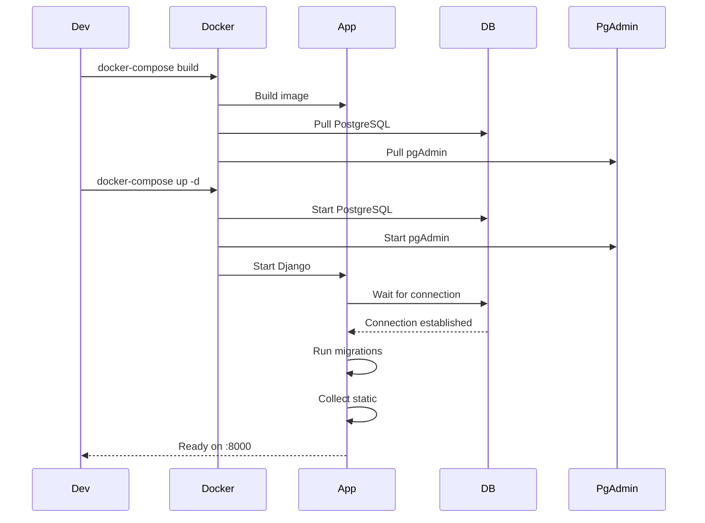
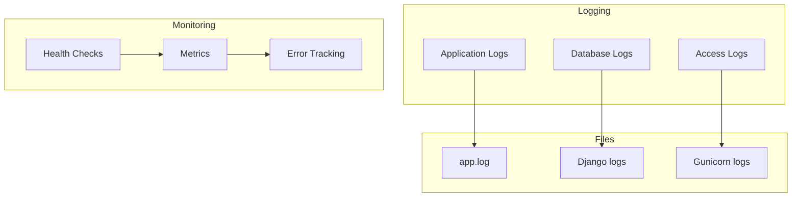
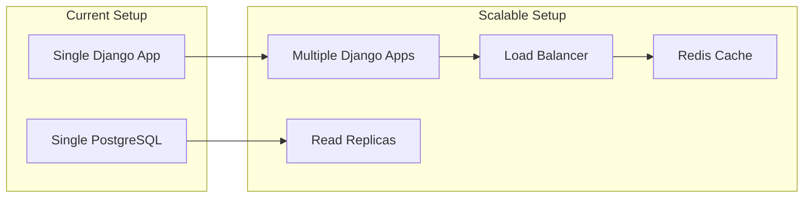

# Diagrama de Deployment

## Arquitetura de Infraestrutura



## Estrutura de Containers



## Configuração de Rede



## Volumes e Persistência

```mermaid
graph LR
    subgraph "Host Volumes"
        AppLogs[./app.log]
        PostgresData[./postgres_data]
        PgAdminData[./pgadmin_data]
    end
    
    subgraph "Container Volumes"
        AppVolume[/app]
        DBVolume[/var/lib/postgresql/data]
        PgAdminVolume[/var/lib/pgadmin]
    end
    
    AppLogs --> AppVolume
    PostgresData --> DBVolume
    PgAdminData --> PgAdminVolume
```

## Variáveis de Ambiente



## Fluxo de Deployment



## Monitoramento e Logs



## Segurança

```mermaid
graph TB
    subgraph "Authentication"
        JWT[JWT Tokens]
        Bearer[Bearer Authentication]
        Refresh[Token Refresh]
    end
    
    subgraph "Authorization"
        IsAuthenticated[IsAuthenticated]
        Permissions[Custom Permissions]
    end
    
    subgraph "Data Protection"
        HTTPS[HTTPS (Production)]
        CORS[CORS Headers]
        CSRF[CSRF Protection]
    end
    
    JWT --> Bearer
    Bearer --> IsAuthenticated
    IsAuthenticated --> Permissions
    
    HTTPS --> CORS
    CORS --> CSRF
```

## Escalabilidade

