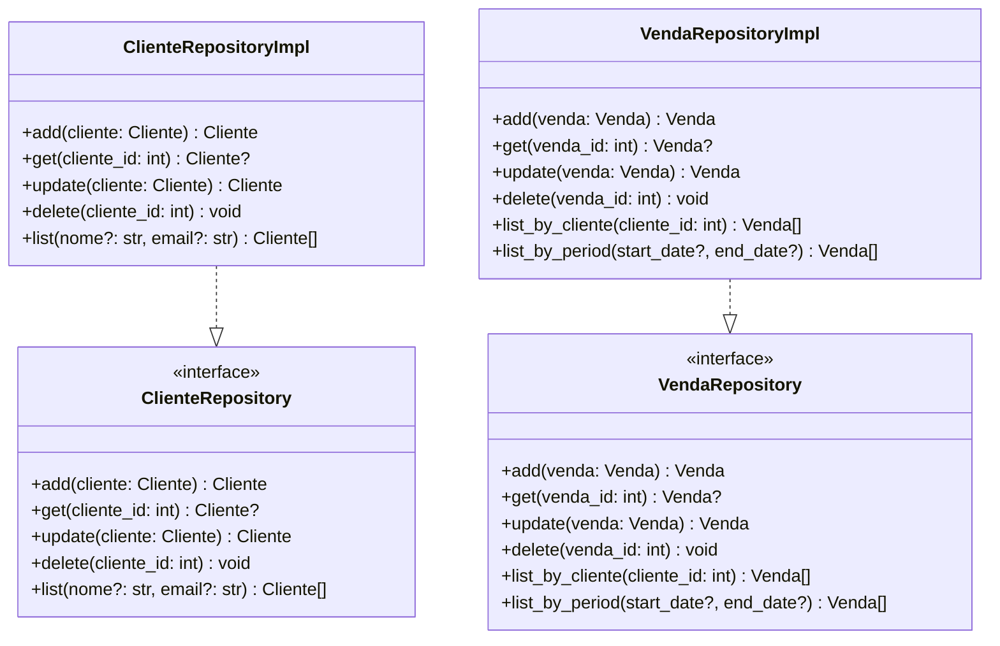
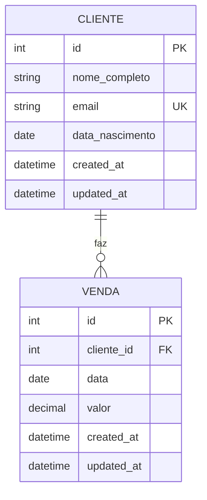

# Diagrama do Modelo de Domínio

## Entidades do Domínio

```mermaid
classDiagram
    class Cliente {
        -id: int
        -nome_completo: str
        -email: str
        -data_nascimento: date
        +__init__(nome_completo, email, data_nascimento)
        +get_nome_completo() str
        +get_email() str
        +get_data_nascimento() date
    }
    
    class Venda {
        -id: int
        -cliente_id: int
        -data: date
        -valor: float
        +__init__(cliente_id, data, valor)
        +get_cliente_id() int
        +get_data() date
        +get_valor() float
    }
    
    Cliente ||--o{ Venda : "faz"
```

## Contratos de Repositório



## Regras de Negócio

### Cliente
- ✅ **Email único**: Não pode haver dois clientes com o mesmo email
- ✅ **Nome obrigatório**: Nome completo é obrigatório
- ✅ **Data de nascimento**: Deve ser uma data válida

### Venda
- ✅ **Cliente obrigatório**: Toda venda deve ter um cliente
- ✅ **Valor positivo**: Valor da venda deve ser maior que zero
- ✅ **Data válida**: Data da venda deve ser uma data válida

## Relacionamentos



## Validações de Domínio

### Cliente
- Email deve ser único no sistema
- Nome completo não pode ser vazio
- Data de nascimento deve ser uma data válida

### Venda
- Cliente deve existir no sistema
- Valor deve ser maior que zero
- Data deve ser uma data válida 