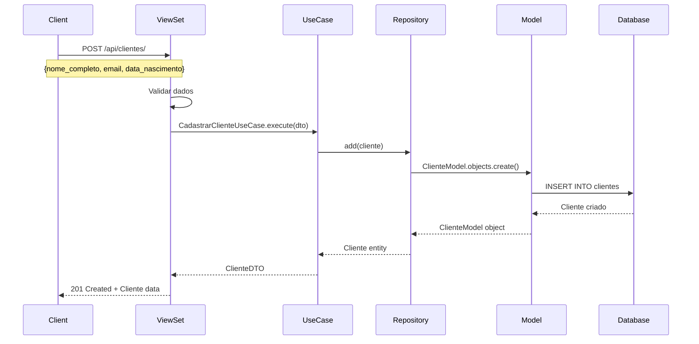
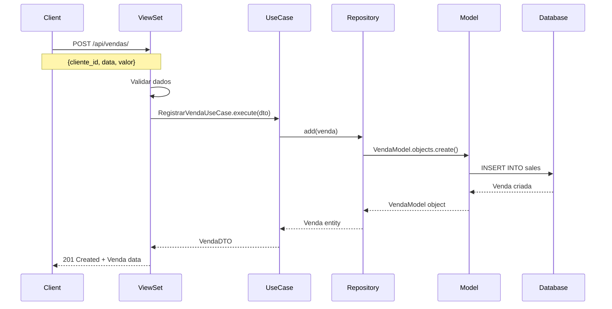
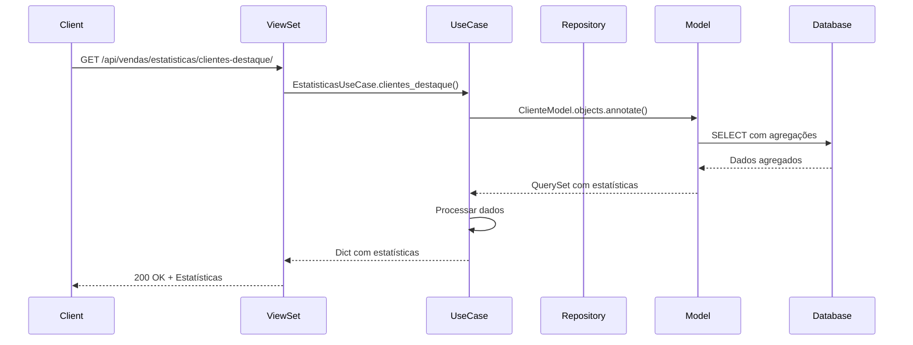
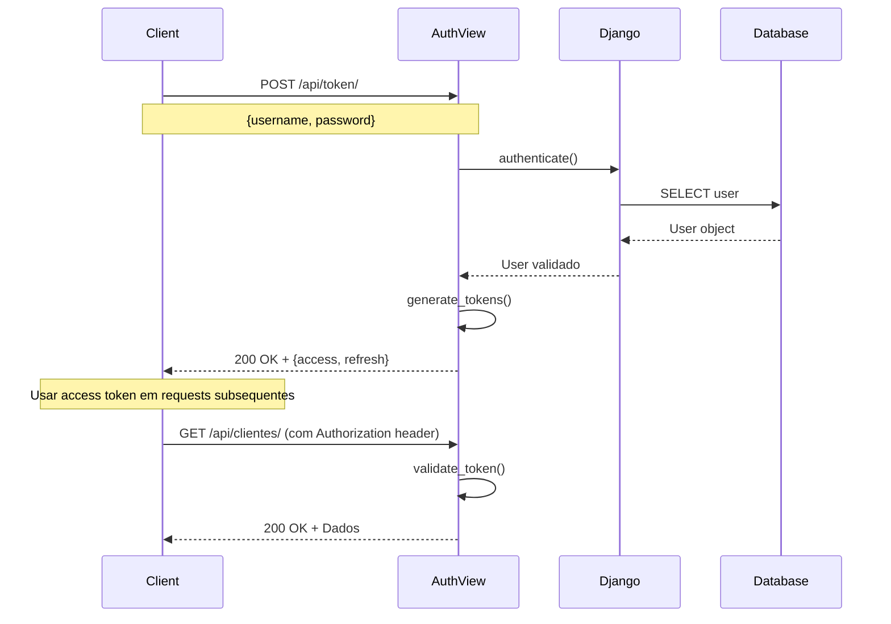
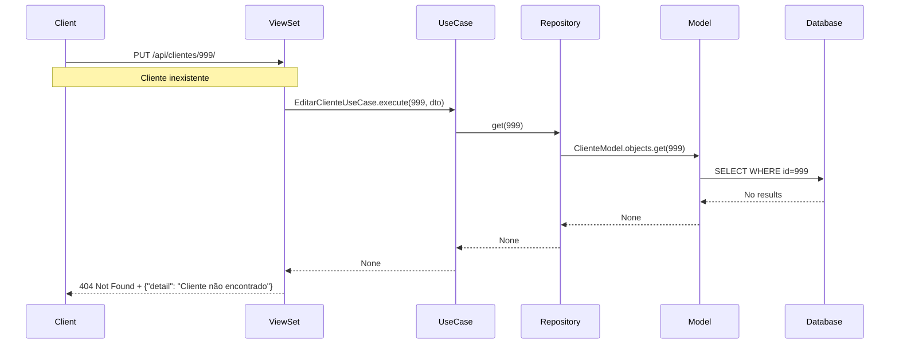

# Diagrama de Sequência

## Fluxo: Cadastrar Cliente e Registrar Venda

### 1. Cadastro de Cliente

### 2. Registro de Venda

### 3. Consulta de Estatísticas

## Fluxo de Autenticação

## Fluxo de Erro

## Componentes da Sequência

### ViewSet
- Recebe requisições HTTP
- Valida dados de entrada
- Chama use cases
- Retorna respostas HTTP

### Use Case
- Contém lógica de negócio
- Orquestra operações
- Valida regras de domínio
- Retorna DTOs

### Repository
- Abstrai acesso a dados
- Implementa contratos
- Converte entre entidades e models

### Model
- Representa tabela no banco
- Usa Django ORM
- Executa queries SQL

### Database
- PostgreSQL
- Armazena dados persistentes
- Executa queries SQL 