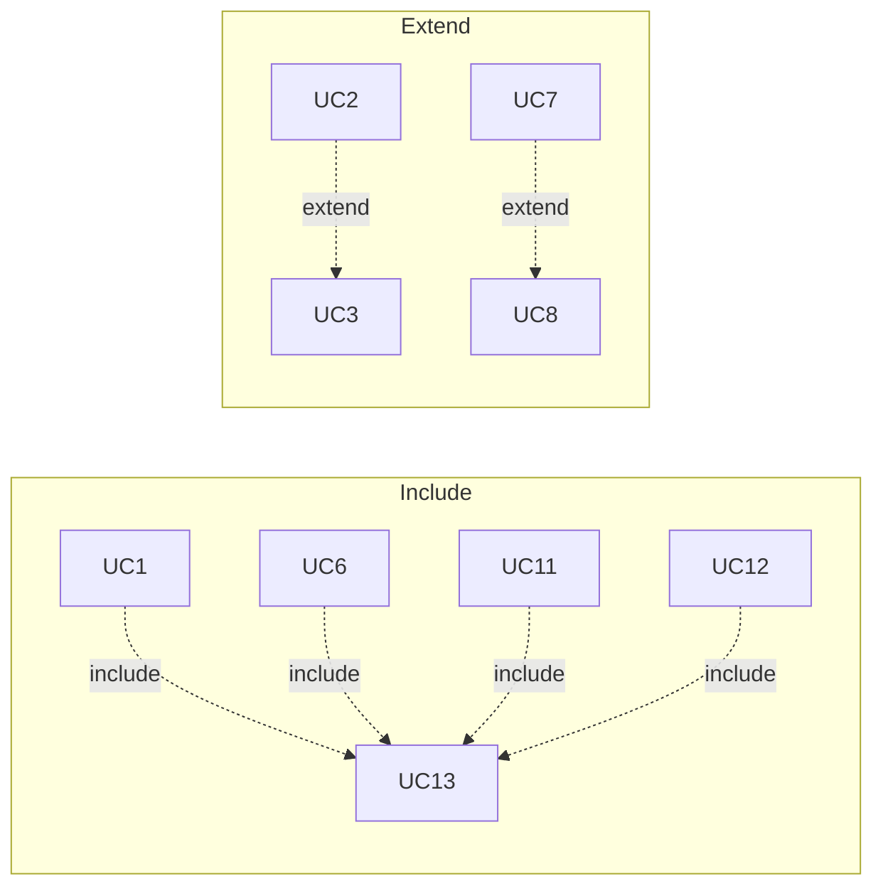

# Diagrama de Casos de Uso

## Casos de Uso Principais

```mermaid
graph TB
    subgraph "Sistema de Loja de Brinquedos"
        subgraph "Gestão de Clientes"
            UC1[UC1: Cadastrar Cliente]
            UC2[UC2: Listar Clientes]
            UC3[UC3: Obter Cliente]
            UC4[UC4: Atualizar Cliente]
            UC5[UC5: Deletar Cliente]
        end
        
        subgraph "Gestão de Vendas"
            UC6[UC6: Registrar Venda]
            UC7[UC7: Listar Vendas]
            UC8[UC8: Obter Venda]
            UC9[UC9: Atualizar Venda]
            UC10[UC10: Deletar Venda]
        end
        
        subgraph "Estatísticas"
            UC11[UC11: Gerar Estatísticas de Vendas por Dia]
            UC12[UC12: Gerar Estatísticas de Clientes Destaque]
        end
        
        subgraph "Autenticação"
            UC13[UC13: Autenticar Usuário]
            UC14[UC14: Renovar Token]
        end
    end
    
    subgraph "Atores"
        Admin[Administrador]
        API[API Client]
    end
    
    Admin --> UC1
    Admin --> UC2
    Admin --> UC3
    Admin --> UC4
    Admin --> UC5
    Admin --> UC6
    Admin --> UC7
    Admin --> UC8
    Admin --> UC9
    Admin --> UC10
    Admin --> UC11
    Admin --> UC12
    Admin --> UC13
    Admin --> UC14
    
    API --> UC2
    API --> UC3
    API --> UC4
    API --> UC5
    API --> UC6
    API --> UC7
    API --> UC8
    API --> UC9
    API --> UC10
    API --> UC11
    API --> UC12
```

## Detalhamento dos Casos de Uso

### UC1: Cadastrar Cliente
**Ator:** Administrador, API Client  
**Pré-condições:** Usuário autenticado  
**Fluxo principal:**
1. Sistema solicita dados do cliente
2. Usuário informa nome, email e data de nascimento
3. Sistema valida os dados
4. Sistema cria o cliente
5. Sistema retorna confirmação

**Pós-condições:** Cliente cadastrado no sistema

### UC2: Listar Clientes
**Ator:** Administrador, API Client  
**Pré-condições:** Usuário autenticado  
**Fluxo principal:**
1. Usuário solicita listagem de clientes
2. Sistema retorna lista de clientes
3. Opcional: Sistema filtra por nome ou email

**Pós-condições:** Lista de clientes exibida

### UC6: Registrar Venda
**Ator:** Administrador, API Client  
**Pré-condições:** Usuário autenticado, cliente existente  
**Fluxo principal:**
1. Sistema solicita dados da venda
2. Usuário informa cliente, data e valor
3. Sistema valida os dados
4. Sistema registra a venda
5. Sistema retorna confirmação

**Pós-condições:** Venda registrada no sistema

### UC11: Gerar Estatísticas de Vendas por Dia
**Ator:** Administrador, API Client  
**Pré-condições:** Usuário autenticado  
**Fluxo principal:**
1. Usuário solicita estatísticas
2. Sistema calcula total de vendas por dia
3. Sistema retorna dados agregados

**Pós-condições:** Estatísticas geradas

### UC12: Gerar Estatísticas de Clientes Destaque
**Ator:** Administrador, API Client  
**Pré-condições:** Usuário autenticado  
**Fluxo principal:**
1. Usuário solicita estatísticas
2. Sistema identifica:
   - Cliente com maior volume de vendas
   - Cliente com maior média de valor
   - Cliente com maior frequência
3. Sistema retorna dados

**Pós-condições:** Estatísticas de destaque geradas

## Relacionamentos

## Regras de Negócio

### Validações
- ✅ Email único para clientes
- ✅ Valor positivo para vendas
- ✅ Cliente existente para vendas
- ✅ Data válida para vendas

### Permissões
- ✅ Autenticação JWT obrigatória
- ✅ Apenas usuários autenticados podem acessar
- ✅ Logs de todas as operações 